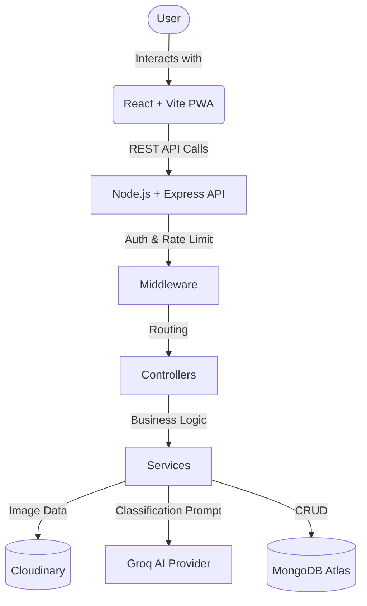

# WasteWise AI - Architecture

## High Level Data Flow



## Directory Structure (Frozen)

### Backend (`server/`)
- `config/`: Database, Environment, Cloudinary, AI config.
- `controllers/`: Request handlers (e.g., `scanController.js`, `authController.js`).
- `middleware/`: Auth, Roles, Rate Limiting, File Upload handling.
- `models/`: Mongoose Schemas (`User`, `Scan`, `Notification`, `AuditLog`, etc.).
- `routes/`: API endpoint definitions.
- `services/`: Business logic abstraction (AI, Scan, Gamification, Analytics).
- `utils/`: Helpers, formatting, error classes.

### Frontend (`client/`)
- `components/`: Reusable UI elements (Buttons, Layouts, Charts).
- `pages/`: Route-level views (`Dashboard`, `Scan`, `History`).
- `context/`: React Context providers (`AuthContext`).
- `hooks/`: Custom React hooks (`useOnlineStatus`).
- `services/`: Axios API call wrappers.
- `assets/`: Static files and images.

## Service Layer Pattern
Controllers must NOT contain heavy business logic. They should extract the request body, call the appropriate Service, and format the response.

```javascript
// Controller
const processScan = async (req, res) => {
  const result = await ScanService.handleNewScan(req.file, req.user);
  res.status(200).json(result);
}
```
